# Wedding Planner


  <p align="center">
  
  </p>

### Table of Contents

- [Project Description](#project-description)
- [Reference Links](#reference-links)
  - [Wedding Planner Application Live Link](https://wedding-planner-platform.herokuapp.com/)
  - [Wedding Planner Application GitHub Repo](https://github.com/wedding-planner-app/wedding-planner)
  - [Project Board](https://github.com/wedding-planner-app/wedding-planner/projects/1)
- [User Stories](#user-stories)
- [Concept](#concept)
  - [Actions Diagram](#actions-diagram)
  - [Design](#design)
    - [Architecture](#architecture)
    - [ER Diagram](#er-diagram)
    - [APIs Docs](#apis-docs)
    - [Whiteboards](#whiteboards)
    - [Wireframes](#wireframes)
- [Application MVP](#application-mvp)
- [Installation and Technology](#installation-and-technology)
  - [Installation Instructions](#installation-instructions)
  - [Core Project Technologies](#core-project-technologies)
  - [Core Node Dependencies](#core-node-depencencies)
- [Future Development](#future-development)
- [Team Members](#team-members)

---

## Project Description

**Summer weddings** are in full swing!! To help make wedding planning easier, we would like to develop a _wedding planner web application_ that will help any wedding planner easily plan and organize all the details surrounding the big day. This application will allow users to create a profile under which they can create **one** or **more** wedding event plans.

---

## Reference Links

Link to Wedding Planner Applications deployed on Heroku - [Wedding Planner Application Live Link](https://wedding-planner-platform.herokuapp.com/)

Link to GitHub Repo used for application development - [Wedding Planner Application GitHub Repo](https://github.com/wedding-planner-app/wedding-planner)

Link to Project Board used for application development - [Project Board](https://github.com/wedding-planner-app/wedding-planner/projects/1)

---

## User Stories

```
AS a wedding planner
I WANT to be able to use an online web application
SO THAT I can better plan an awesome wedding
```

---

## Concept

This platform is a full stack web application that will allow a wedding planner to `plan` and `manage` a client’s wedding. Weddings are significant events in people's lives and as such, couples are often willing to spend considerable amount of money to ensure that their weddings are well-organized. The Wedding Planner application allows the user to keep all guests, invitations, venue information, and more in one place.

#### Actions Diagram

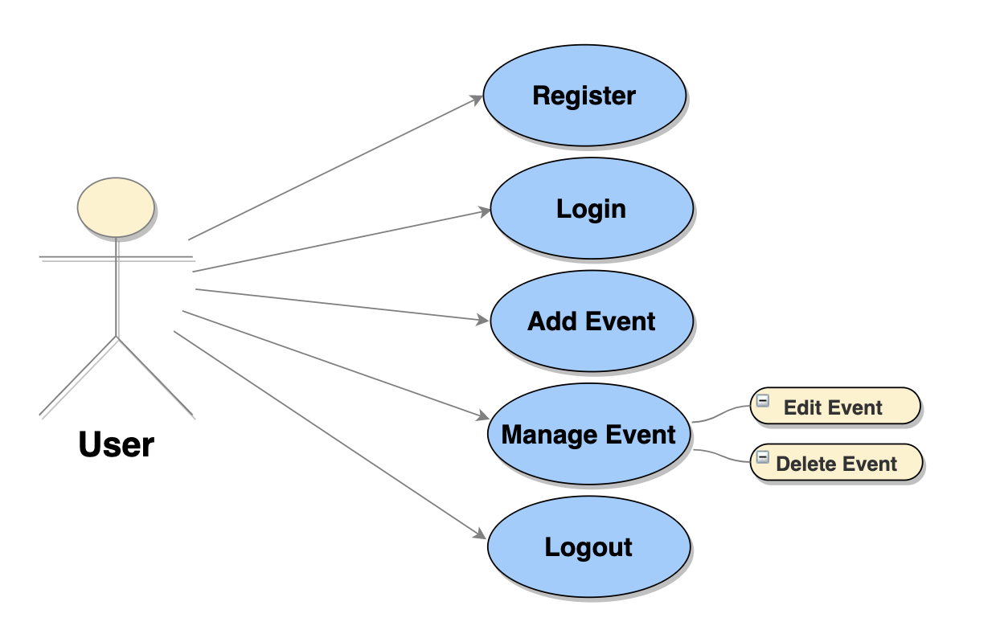

#### Design

This section addresses the platforms's basic functionality and style/design utilized for the multiple features included thorughout the site.

#### Architecture

This project is based on **MVC design** (_model-view-control_), which facilitates a better organziation pattern for the code used to develop this web application. The MVC folder pattern helps separate the application's care back-end business logic, front-end UI design, and user interaction. The diagram included below outlines the architecture of this web application.

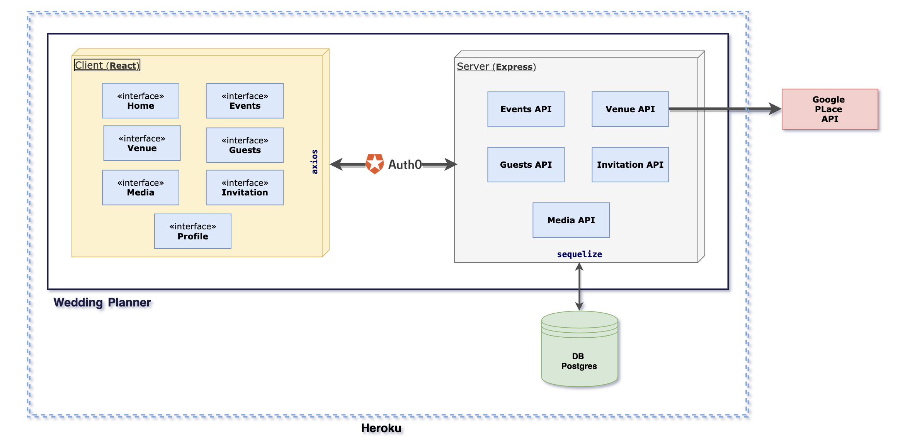

##### ER Diagram

The entity relationship (ER) diagram below provides a visual representation of how the data is saved inside the application's back-end database. This diagram also demondtrates the relationship between each database table.

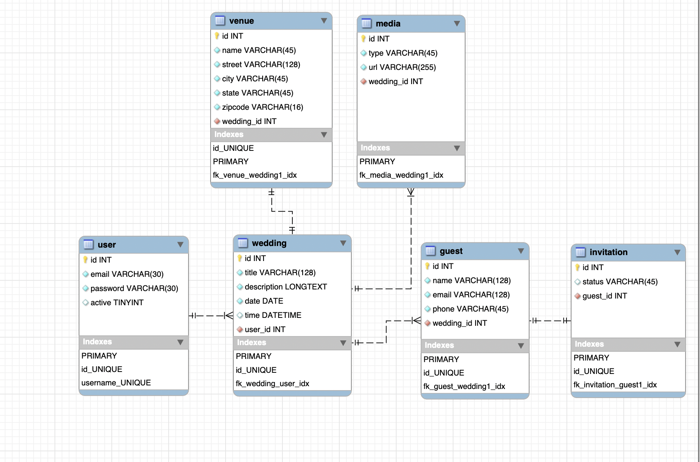

#### APIs Docs

A simple **wedding planner APIs** to manage events.


Following the [APIs Documentation](https://documenter.getpostman.com/view/11452429/T1LHHA3X) section details the first steps users need to start using the **APIs**.

Consider including a _Run_ in _Postman_ button. (Postman is a REST API GUI client) If you have your API endpoints integrated with Postman, you can export your Postman collections as a widget to embed in an HTML page.

<details>
<summary> Click to expand</summary>
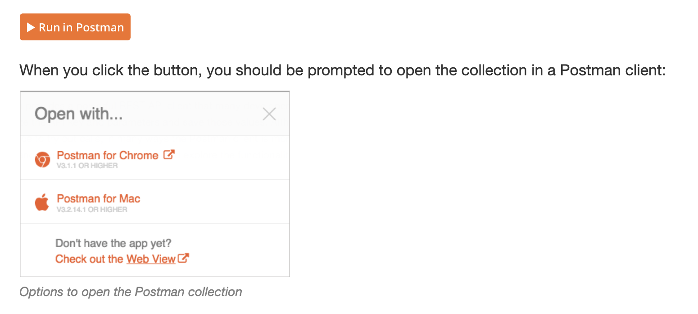
  
</details>

##### Whiteboards

<details>
  <summary>Click to expand!</summary>
  <p>Image 1</p>
  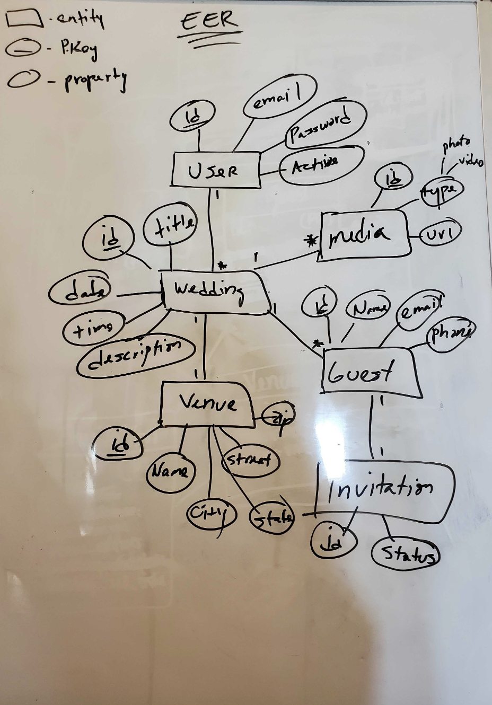
  <p>Image 2</p>
  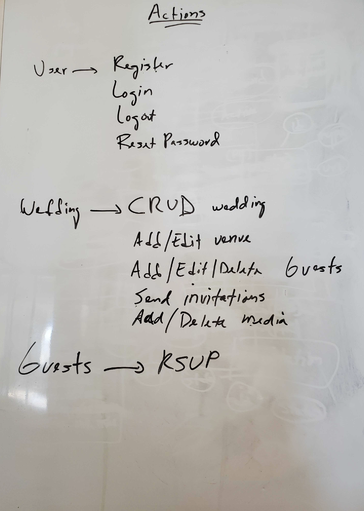
  
</details>

##### Wireframes

<details>
  <summary>Click to expand!</summary>
  <p>Homepage webpage wireframe</p>
  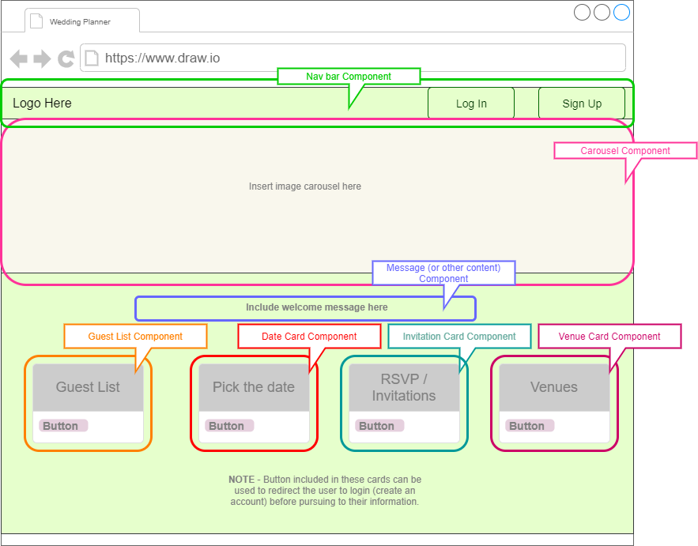

  <p>Login webpage wireframe</p>
  

  <p>User profile wireframe</p>
  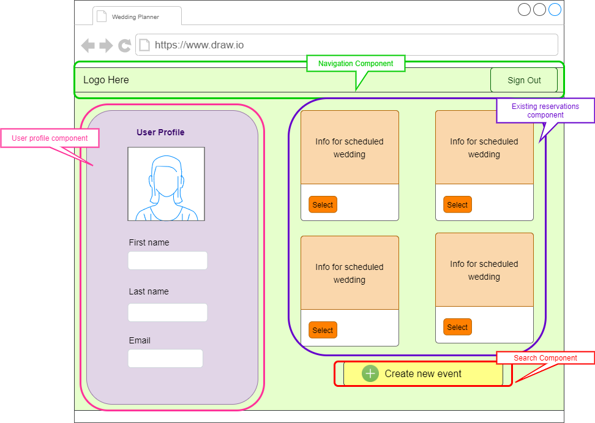

  <p>Existing events wireframe</p>
  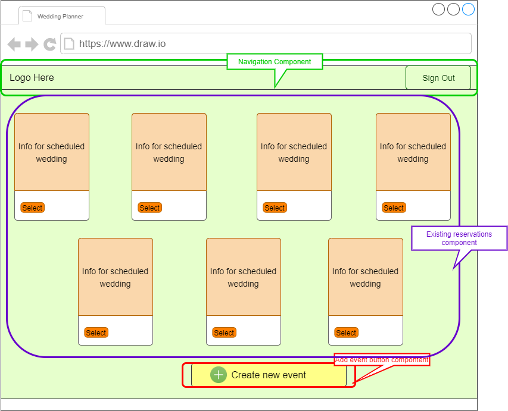

  <p>Create event reservation wireframe</p>
  

  <p>Venues wireframe</p>
  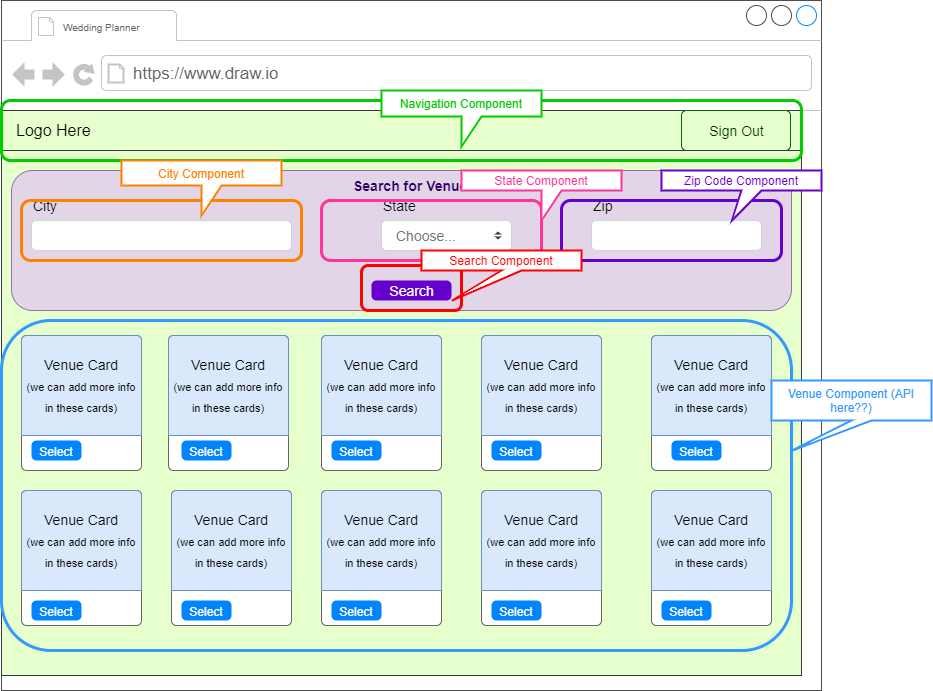

  <p>Guest list webpage wireframe</p>
  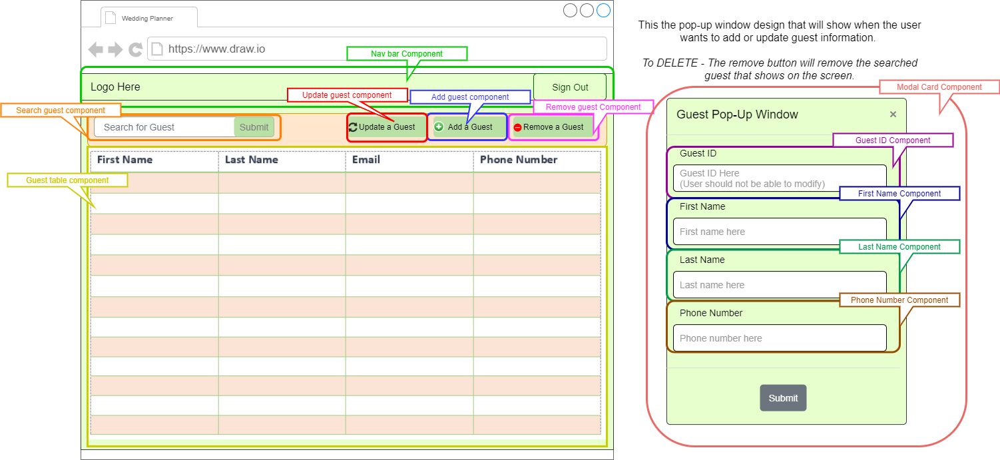

  <p>FUTURE DEVELOPMENT - Invitation wireframe</p>
  

  <p>FUTURE DEVELOPMENT - Media wireframe</p>
  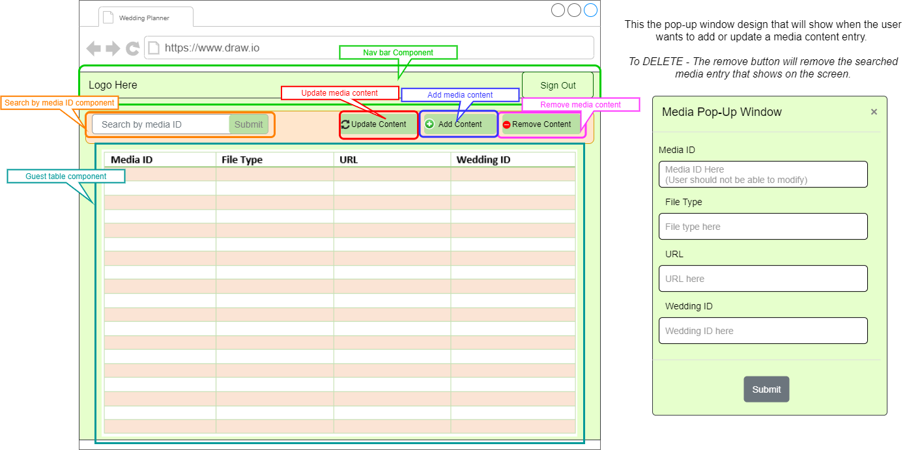
</details>

## Application MVP

- The user can register and login to the platform using **Auth0**.
- The user can see his/her **profile**.
- The user can list, create, edit, and delete **wedding events**.
- The user can **search venues** and assign to wedding event.
- The user can send **invitations**.
- The user can **logout** .

---

## Installation and Technology

Reference the subsections below for installation instructions and a list of technologies used for the development of this wedding planner application.

_FYI - Environment Variables:_
Please note that various environment variables are used in both `client folder` and `root directory` of this application, so to test in your local environment, the user will need to indivually generate the following environment variables.

### Installation Instructions

In order to successfully develop and launch this assignment, the following items must be installed and/or accessible from your working environment (i.e. laptop, computer, etc.).

- **Node.js** - Make sure Node.js is installed in your machine. If Node.js is not installed on your machine, [click here](https://nodejs.org/en/) to download the application.
- **Node Modules** - This project used various `node modules`, which are listed in the package.json files listed in both the `client folder` and `main root folder` of this application. A screenshot of dependencies listed in each package.json file are listed included below. Please run `npm install` in your terminal to install all required node modules.

Reference the section below for a list (and brief description) of core node modules and technologies used to develop this application.

#### Package.json file in Root Directory

<details>
  <summary>Click to expand!</summary>
  <p>Package.json file in Root Directory</p>
  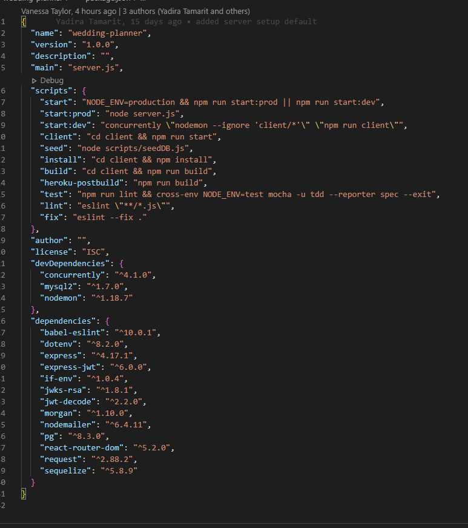
  
</details>

#### Package.json in Client Folder

<details>
  <summary>Click to expand!</summary>
  <p>Package.json in Client Folder</p>
  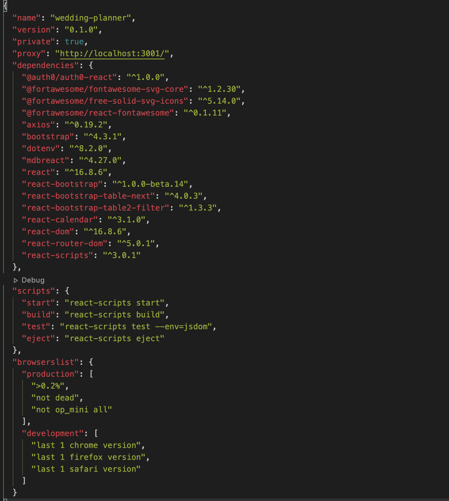
  
</details>

### Core Project Technologies

Here is a list of all the core technologies / core dependencies used to develop this application.

- `Model-View-Controller (**MVC**) framework as an architectural pattern`
  <details>
    <summary>Click to expand!</summary>
    <p>MVC folder pattern for this project</p>
    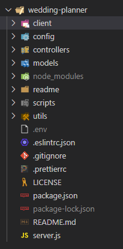/=
  
  </details>

- `Node.js - An asynchronous event-driven JavaScript runtime`
- `React.js - A JavaScript library for building user interfaces`
- `MySQL database with a Sequelize ORM`
- `Postgres in production`
- `Deploy web app using Heroku`
- `User authentication and secure API with Auth0`

### Core Node Dependencies

The dependencies listed below are all the NPM packages used throughout this project. Each package can be accessed on [the npmjs.com website](https://www.npmjs.com/). The descriptions for each NPM package listed below was gathered from [the npmjs.com website](https://www.npmjs.com/).

- `babel-eslint - Allows the user to lint ALL valid Babel code with the fantastic ESLint`
- `dotenv - A zero-dependency module that loads environment variables from a .env file into process.env`
- `express - Provides small, robust tooling for HTTP servers for solutions for single page applications, web sites, hybrids, or public HTTP APIs`
- `express-jwt - Provides Express middleware for validating JWTs (JSON Web Tokens) through the jsonwebtoken module`
- `if-env - Helps simplify npm scripts`
- `jwks-rsa - A library to retrieve RSA signing keys from a JWKS (JSON Web Key Set) endpoint`
- `jwt-decode - A small browser library that helps decoding JWTs token which are Base64Url encoded`
- `morgan:"HTTP request logger middleware for node.js"`
- `nodemailer - Send e-mails from Node.js`
- `pg - Non-blocking PostgreSQL client for Node.js`
- `react-router-dom - DOM bindings for React Router`
- `sequelize - A promise-based Node.js ORM for Postgres, MySQL, MariaDB, SQLite and Microsoft SQL Server`

---

## Future Development

For `future` development, we would like to incorporate the following feature `enhancements` into our web application:

- Enhance the overall application's UI.
- Add actual wedding data, such as picture and video.
- Generate guests friendly interface with memories of the event.
- Allow capability to order memorabilia items based on data of the event.
- Allow wedding planner to import CSV data files.
- Develop corresponding mobile app.

## Team Members

- [Krystal Duran](https://github.com/KEDuran)
- [Stephen Guzman](https://github.com/steveo9219)
- [Vanessa Taylor](https://github.com/vantaylo)
- [Yadira Tamarit](https://github.com/ystamaritq)

---

[Table of Contents](#table-of-contents)
